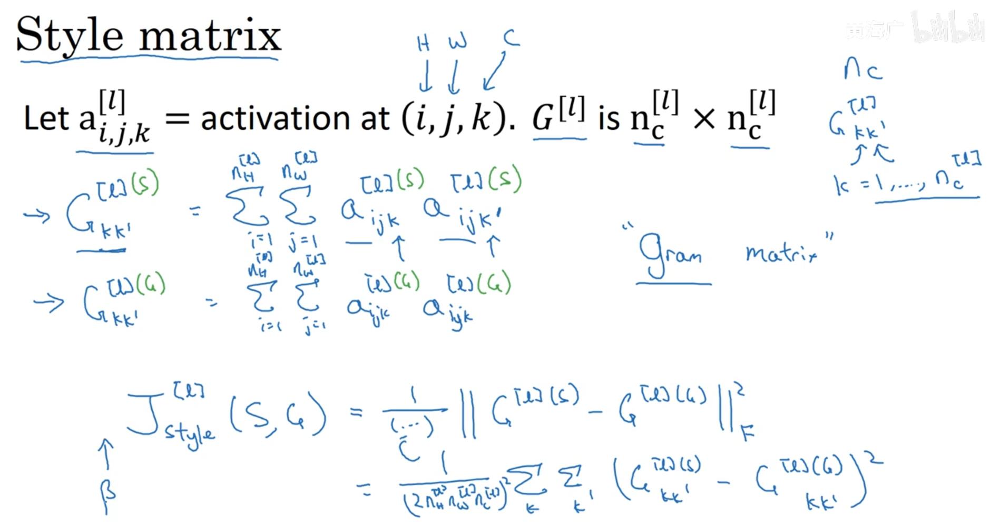

# 人脸识别和神经风格转换

- [人脸识别和神经风格转换](#人脸识别和神经风格转换)
  - [1. 人脸识别(face recognition)](#1-人脸识别face-recognition)
    - [1.1 什么是人脸识别？(What is face recognition?)](#11-什么是人脸识别what-is-face-recognition)
    - [1.2 One-Shot学习（One-shot learning）](#12-one-shot学习one-shot-learning)
    - [1.3 Siamese 网络（Siamese network）](#13-siamese-网络siamese-network)
    - [1.4 Triplet 损失（Triplet loss）](#14-triplet-损失triplet-loss)
    - [1.5 面部验证与二分类（Face verification and binary classification）](#15-面部验证与二分类face-verification-and-binary-classification)
  - [2. 神经风格转换(neural style transfer)](#2-神经风格转换neural-style-transfer)
    - [2.1 什么是神经风格转换？（What is neural style transfer?）](#21-什么是神经风格转换what-is-neural-style-transfer)
    - [2.2  什么是深度卷积网络？（What are deep ConvNets learning?）](#22--什么是深度卷积网络what-are-deep-convnets-learning)
    - [2.3 代价函数（Cost function）](#23-代价函数cost-function)
    - [2.4 内容代价函数（Content cost function）](#24-内容代价函数content-cost-function)
    - [2.5 风格代价函数（Style cost function）](#25-风格代价函数style-cost-function)
  - [3.  一维到三维推广（1D and 3D generalizations of models）](#3--一维到三维推广1d-and-3d-generalizations-of-models)

---

## 1. 人脸识别(face recognition)

### 1.1 什么是人脸识别？(What is face recognition?)

### 1.2 One-Shot学习（One-shot learning）

one shot learning，一次学习，单单通过一张照片就能识别这个人

学习similarity function

通过`d(img1,img2)`来表示两张图片的差异程度，如果`d`大于某个阈值，那么就表示差别很大，如果小于某个阈值，则认为是同一个人。

### 1.3 Siamese 网络（Siamese network）

利用Siamese网络来实现计算`d(img1,img2)`

如图，输入两张图片  $x^{(1)}, x^{(2)}$  ，经过一个卷积神经网络，去掉最后的`softmax`层，可以得到 `N`维的向量，  $f\left(x^{(1)}\right), f\left(x^{(2)}\right)$  ，假设是 `128`维，而 `N` 维的向量就相当于是对输入图片的的编码 (`encoding`)。

然后比较这两个向量之间的差值:

$d(x 1, x 2)=\|f(x 1)-f(x 2)\|_{2}^{2}$

如果距离  `d`  很小，那表示这两张图片很相近，认为是同一个人。

如果距离  `d`  很大，那么表示这两张图片差别很大，不是同一个人

### 1.4 Triplet 损失（Triplet loss）

要得到输入图片的向量编码`f(x)`，是需要经过卷积神经网络的，那么卷积神经网络的参数如何确定呢？使用的方法就是`Triplet loss`损失函数，而后用梯度下降法进行迭代。

- `A(Anchor)`：表示要检测的目标图片
- `P(Positive)`：表示与anchor同个人的图片
- `N(Negative)`：表示与anchor不同个人的图片

`Loss function`：

$$L(A, P, N) = max(\|f(A) - f(P)\|^{2}  - \|f(A) - f(N)\|^{2} + \alpha，0)$$

整个网络的代价函数就是把所有的图片损失加起来：
$$J = \sum_{i=1}^{m} L(A^{(i)}, P^{(i)}, N^{(i)})$$

尽量选择那些相似的图片进行每一组的训练：
$$d(A, P) \simeq  d(A, N)$$

### 1.5 面部验证与二分类（Face verification and binary classification）

除了用Triplet loss进行训练以外，还有别的方法来进行训练，也就是可以把Siamese网络当做一个二分类的问题。

---

## 2. 神经风格转换(neural style transfer)

### 2.1 什么是神经风格转换？（What is neural style transfer?）

神经风格的迁移，就是输入两张图片，一张当做内容图片content，另一张当做风格图片style，输出的图片g兼具有一张的内容，和另一张的风格。

### 2.2  什么是深度卷积网络？（What are deep ConvNets learning?）

在进行风格迁移前，我们需要了解我们的神经网络到底在学些什么东西，把中间的隐藏单元拎出来看看。

方法：

- 在当前层挑选一个隐藏单元；
- 遍历训练集，找到最大化地激活了该运算单元的图片或者图片块；
- 对该层的其他运算单元执行操作。

第一层的神经单元通常会寻找一些简单的特征，如边缘或者颜色阴影等。

而后随着层数的增加，隐藏层单元看到的东西就越来越复杂了

### 2.3 代价函数（Cost function）

目标是由内容图片C和风格图片S，生成最终的风格迁移图片G

`Loss function`：

$$J(G) = \alpha J_{content}(C, G) + \beta J_{style}(S, G)$$

- $J_{content}(C, G)$：代表生成图片G的内容和内容图片C的内容的相似度
- $J_{style}(S, G)$：代表生成图片G的内容和风格图片S的内容的相似度S

### 2.4 内容代价函数（Content cost function）

- 首先假设我们使用第l层隐藏层来计算$J_{content}(C, G)$，一般取在中间层，而不是最前面的层，或者最后层。因为太浅了啥也看不到，太深了就太像原图了。
- 使用一个预训练的卷积网络。（如，VGG或其他）
- $a^{[l](C)}$和$a^{[l](G)}$分别代表内容图片C和生成图片G的l层的激活值；

$$J_{content}(C,G) =\frac{1}{2} \|a^{[l](C)} - a^{[l](G)}\|^{2}$$ 

### 2.5 风格代价函数（Style cost function）

定义“`Style`”表示`l`层的各个通道激活项之间的相关性。

假设l层有5个通道，渲染成5个颜色。

不同的通道之间代表着不同的神经元学习到的特征，如第一个通道（红色）可以表示含有垂直纹理的特征，第二个通道（黄色）表示区域中出现橙色的特征。

两个通道的相关性就表示图片中出现垂直纹理又出现橙色的可能性大小。

得到不同通道的二元对之后，如何衡量相关性？使用`Gram matrix`

$k$ 和 $k^{'}$代表不同通道

$$
G_{k k^{'}}^{[l](S)} = \sum_{i=1}^{n_{H}^{[l]}} \sum_{j=1}^{n_{W}^{[l]}} 
a_{i,j,k}^{[l](S)} a_{i,j,k^{'}}^{[l](S)}
$$
$$
G_{k k^{'}}^{[l](G)} = \sum_{i=1}^{n_{H}^{[l]}} \sum_{j=1}^{n_{W}^{[l]}} 
a_{i,j,k}^{[l](G)} a_{i,j,k^{'}}^{[l](G)}
$$

代价函数即为两张图片中相关系数矩阵的差值求和，再取平均。

$$
J_{style}^{[l]} = \|G^{[l](s)} - G^{[l](G)}\|^{2}_{F}
$$

---

## 3.  一维到三维推广（1D and 3D generalizations of models）

图片都是2D的卷积运算，其实还可以推广到1D和3D的情况。

典型的1D情况就是信号处理。

3D情况就像CT的切片，是一层一层叠加起来的。

---
