# 循环序列模型（Recurrent Neural Networks）

- [循环序列模型（Recurrent Neural Networks）](#循环序列模型recurrent-neural-networks)
  - [1. 为什么选择序列模型？（Why Sequence Models?）](#1-为什么选择序列模型why-sequence-models)
  - [2.  数学符号（Notation）](#2--数学符号notation)
  - [3. 循环神经网络模型（Recurrent Neural Network Model）](#3-循环神经网络模型recurrent-neural-network-model)
    - [3.1 为什么表用standard network?](#31-为什么表用standard-network)
    - [3.2 Recurrent Neural Network](#32-recurrent-neural-network)
      - [3.2.1 Forward Propagation](#321-forward-propagation)
      - [3.2.2 Backward Propagation（Backpropagation through time）](#322-backward-propagationbackpropagation-through-time)
  - [3. 不同类型的循环神经网络（Different types of RNNs）](#3-不同类型的循环神经网络different-types-of-rnns)
  - [4. 语言模型和序列生成（Language model and sequence generation）](#4-语言模型和序列生成language-model-and-sequence-generation)
    - [4.1 什么是语言模型？](#41-什么是语言模型)
    - [4.2 使用RNN构建语言模型](#42-使用rnn构建语言模型)
  - [5. 对新序列采样（Sampling novel sequences）](#5-对新序列采样sampling-novel-sequences)
  - [6. 循环神经网络的梯度消失（Vanishing gradients with RNNs）](#6-循环神经网络的梯度消失vanishing-gradients-with-rnns)
    - [6.1 梯度消失问题](#61-梯度消失问题)
    - [6.2  GRU单元（Gated Recurrent Unit（GRU））](#62--gru单元gated-recurrent-unitgru)
    - [6.3 长短期记忆（LSTM（long short term memory）unit](#63-长短期记忆lstmlong-short-term-memoryunit)
  - [7. 双向循环神经网络（Bidirectional RNN）](#7-双向循环神经网络bidirectional-rnn)

---

## 1. 为什么选择序列模型？（Why Sequence Models?）

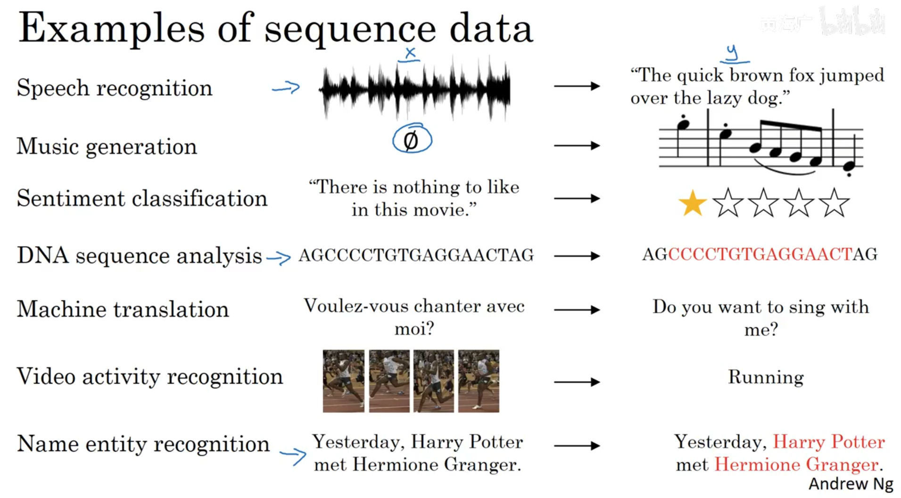

---

## 2.  数学符号（Notation）

$X^{(i)<t>}$：代表第i序列中的第t个词
$X^{<i>}$：代表该系列中第i个词
对应的输出`y`记为$y^{<i>}$

用`one-hot`编码表示$X^{<t>}$的数学形式，假设词表中一共有`10000`个词汇，那么$X^{<t>}$就是一个长度为`10000`的向量，在这之中只有一个维度是`1`，其他都是`0`

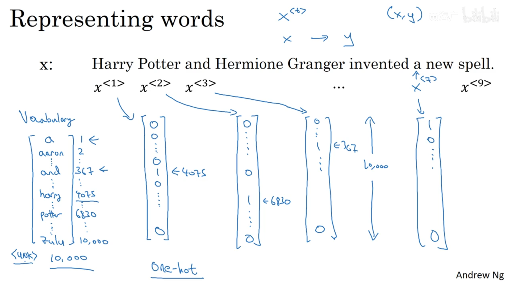

---

## 3. 循环神经网络模型（Recurrent Neural Network Model）

### 3.1 为什么表用standard network?

效果并不是很好，因为：

- 输入和输出在不同的样本中是可以不同长度的（每个句子可以有不同的长度）
- 这种朴素的神经网络结果并不能共享从文本不同位置所学习到的特征。（如卷积神经网络中学到的特征的快速地推广到图片其他位置）

### 3.2 Recurrent Neural Network

循环神经网络采用每一个时间步来计算，输入一个$x^{<t>}$和前面留下来的记忆$a^{<t−1>}$，来得到这一层的输出$y^{<t>}$和下一层的记忆$a^{<t>}$

缺点就是只用到前面的信息

使用到的参数：

- $W_{ax}$管理从输入$X^{<t>}$到隐藏层的链接，每个时间步都用到相同的$W_{ax}$，下面参数也是；
- $W_{aa}$管理激活值$a^{<t>}$到隐藏层的链接，通用每个时间步；
- $W_{ya}$管理隐藏层到激活值$y^{<t>}$的链接，通用每个时间步。

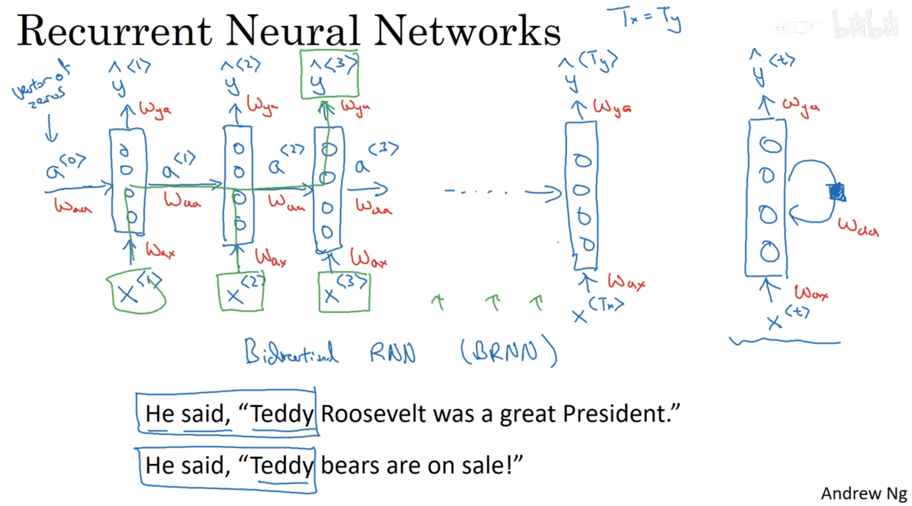

#### 3.2.1 Forward Propagation

$$
a^{<t>} = g_{1}(W_{aa} a^{<t-1>} + W_{ax}X^{t} + b_{a})\\
\hat{y}^{<t>} = g_{2}(W_{ya}a^{<t>} + b_{y})
$$

$g_{1}$一般为`tanh`或`Relu`，$g_{2}$为`sigmoid`

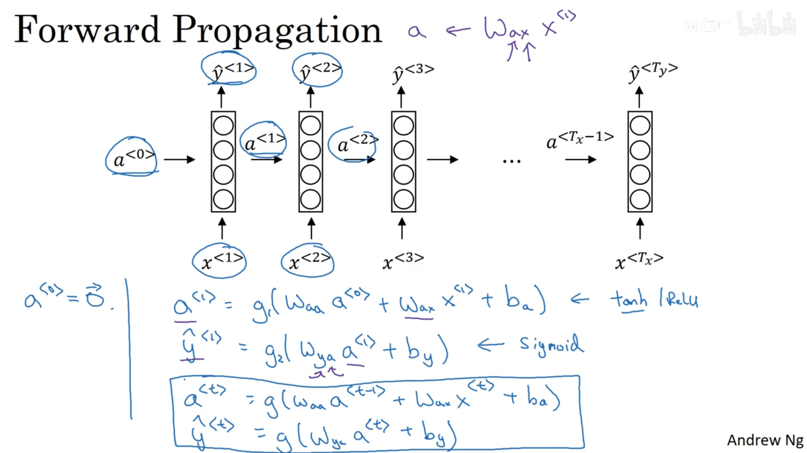

向量化后：

$$
W_{a} = [W_{aa}, W_{ax}]\\
a^{<t>} = g(W_{a}[a^{<t-1>}, X^{<t>}] + b_{a})
$$

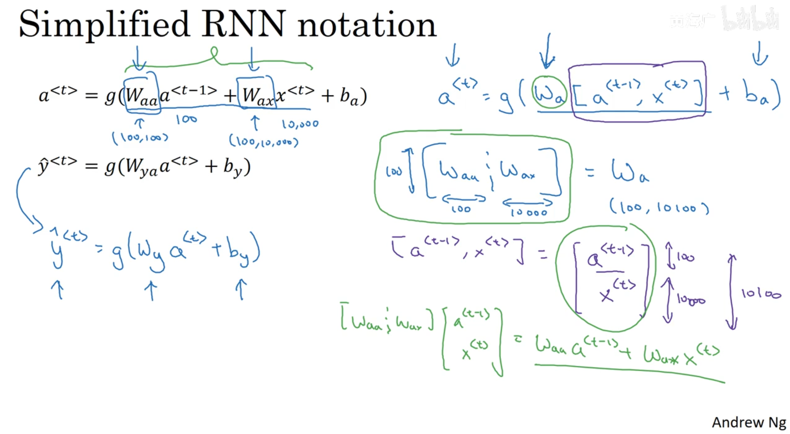

#### 3.2.2 Backward Propagation（Backpropagation through time）

定义一个`Loss function`，然后返回去计算参数的梯度，然后进行梯度下降

`Loss function`:

$$
\begin{array}{l}
\mathcal{L}^{\langle t\rangle}\left(\hat{y}^{\langle t\rangle}, y^{\langle t\rangle}\right)=-y^{\langle t\rangle} \log \hat{y}^{\langle t\rangle}-\left(1-y^{\langle t\rangle}\right) \log \left(1-\hat{y}^{\langle t\rangle}\right) \\
\mathcal{L}(\hat{y}, y)=\sum_{t=1}^{T_{n}} \mathcal{L}^{\langle t\rangle}\left(\hat{y}^{\langle t\rangle}, y^{\langle t\rangle}\right) 
\end{array}
$$

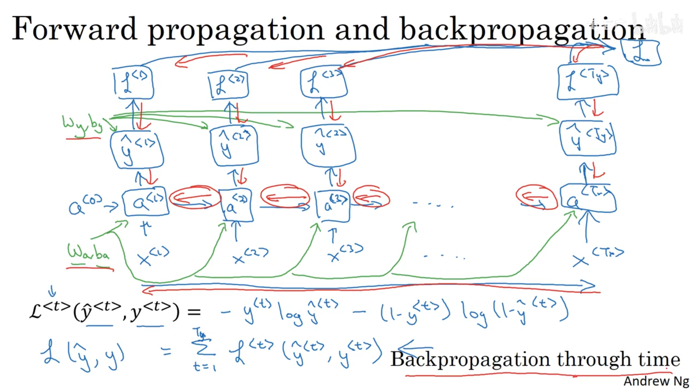

---

## 3. 不同类型的循环神经网络（Different types of RNNs）

对于RNN，不同的问题需要不同的输入输出结构。

- `one to many`：如音乐生成，输入一个音乐类型或者空值，生成一段音乐
- `Many to one`：如情感分类问题，输入某个序列，输出一个值来判断得分。
- `many to many`($T_{x}=T_{y}$)：输入和输出的序列长度相同
- `many to many`($T_{x}!=T_{y}$)：如机器翻译这种，先输入一段，然后自己生成一段，输入和输出长度不一定相同的。

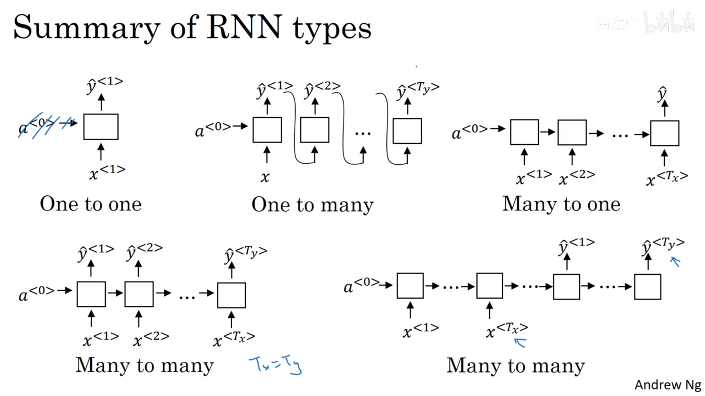

---

## 4. 语言模型和序列生成（Language model and sequence generation）

### 4.1 什么是语言模型？

对于语言模型来说，从输入的句子中，评估各个句子中各个单词出现的可能性，进而给出整个句子出现的可能性。

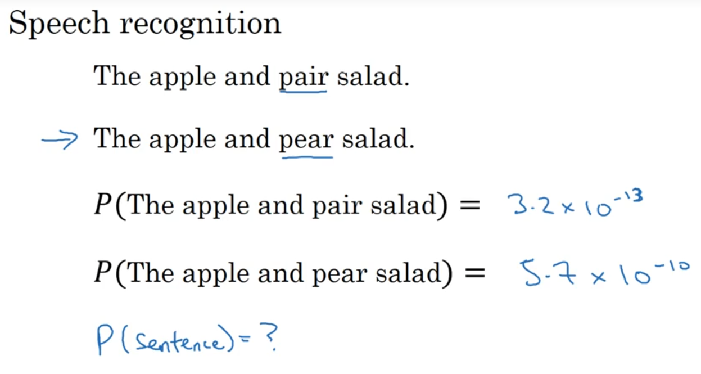

### 4.2 使用RNN构建语言模型

- 训练集：一个很大的语言文本语料库；
- Tokenize：将句子使用字典库标记化；其中，未出现在字典库中的词使用“UNK”来表示；
- 第一步：使用零向量对输出进行预测，即预测第一个单词是某个单词的可能性；
- 第二步：通过前面的输入，逐步预测后面一个单词出现的概率；

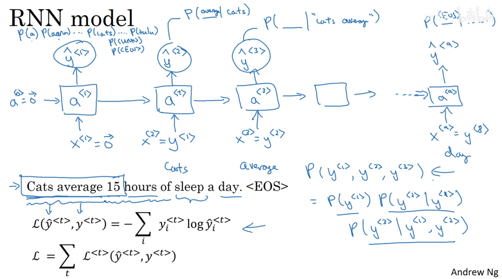

---

## 5. 对新序列采样（Sampling novel sequences）

当我们训练得到了一个模型之后，如果我们想知道这个模型学到了些什么，一个非正式的方法就是对新序列进行采样。具体方法如下：

- 每一步输出`y`时，通常使用 `softmax` 作为激活函数，然后根据输出的分布，随机选择一个值，也就是对应的一个字或者英文单词。

- 后一步的输入用前一步的$y$，即：$X^{<t>} = y^{<t-1>}$，直到输出了终结符，或者输出长度超过了提前的预设值n才停止采样。

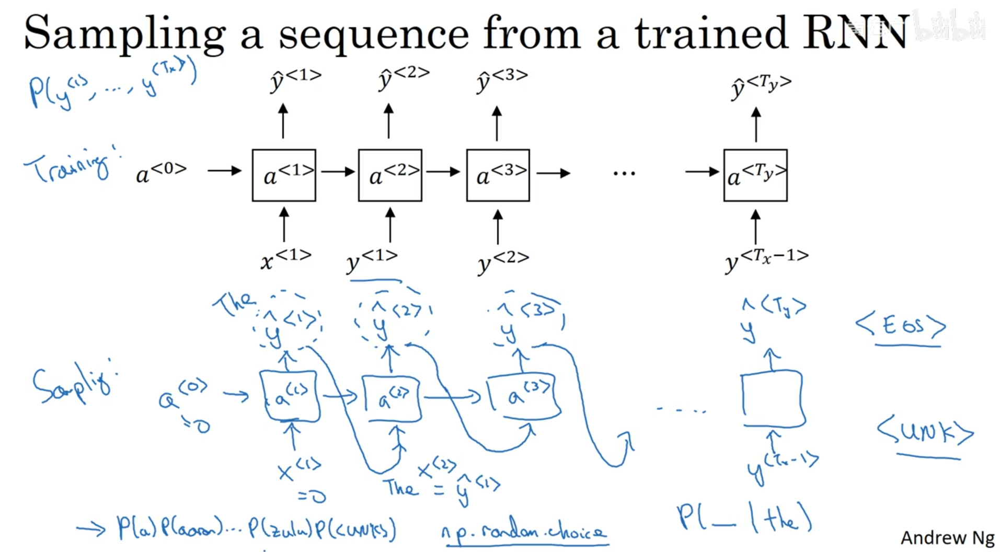

基于字符的模型，计算量较大，现在一般为基于词汇的模型：

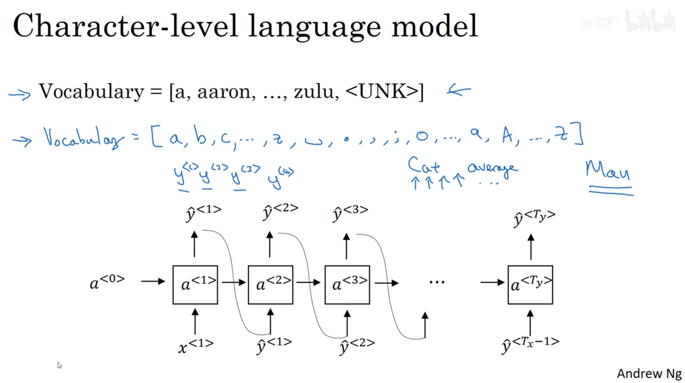

---

## 6. 循环神经网络的梯度消失（Vanishing gradients with RNNs）

### 6.1 梯度消失问题

RNN存在一个梯度消失问题，如：

- The cat, which already ate ………..，was full；
- The cats, which already ate ………..，were full.

cat 和 cats要经过很长的一系列词汇后，才对应 was 和 were，但是我们在传递过程中$a^{<i>}$很难记住前面这么多词汇的内容，往往只和前面最近几个词汇有关而已。即不擅长处理长依赖的问题。

就像神经网络一样，反向传播可能无法影响到前面层的权重。

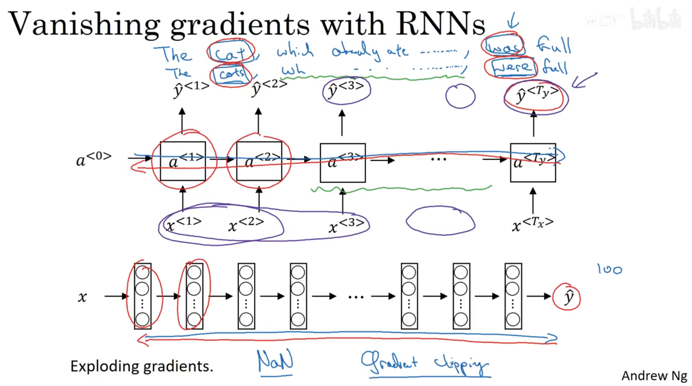

### 6.2  GRU单元（Gated Recurrent Unit（GRU））

使用GRU单元可以有效的捕捉到更深层次的连接，来改善梯度消失问题。

原本的RNN单元：

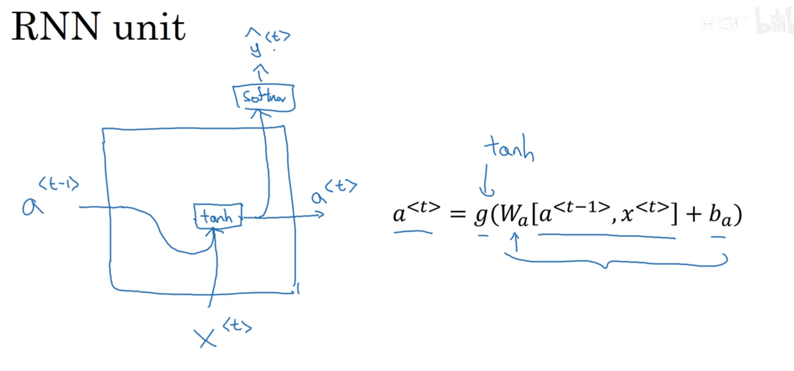

`GRU单元`：门控循环单元

GRU单元多了一个c（memory cell）变量，用来提供长期的记忆能力

还存在另一个门$\Gamma_{r}$，用来控制$\bar{c}$和 $c^{<t−1>}$之间的联系强弱
$$
\begin{array}{l} {C}^{\langle t\rangle}={a}^{\langle t\rangle} \\ \tilde{C}^{\langle t\rangle}=\tanh \left(\omega_{c}\left[c^{\langle t-1\rangle}, x^{\langle t\rangle}\right]+b_{c}\right) \\\Gamma_{u}=\sigma\left(\omega_{u}\left[c^{\langle t-1\rangle}, x^{\langle t\rangle}\right]+b_{u}\right) \\C^{\langle t\rangle}= \Gamma_{u} * \tilde{C}^{\langle t\rangle}+\left(1-\Gamma_{u}\right) * c^{\langle t-1\rangle}\end{array}
$$

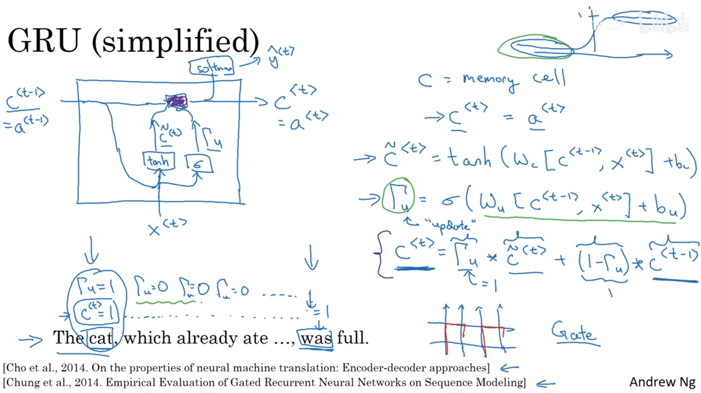

${C}^{\langle t\rangle}$，$\tilde{C}^{\langle t\rangle}$和$\Gamma_{u}$的维度相等

完整的GRU单元：

存在两个门，更新门$\Gamma_{u}$，重置门$\Gamma_{r}$

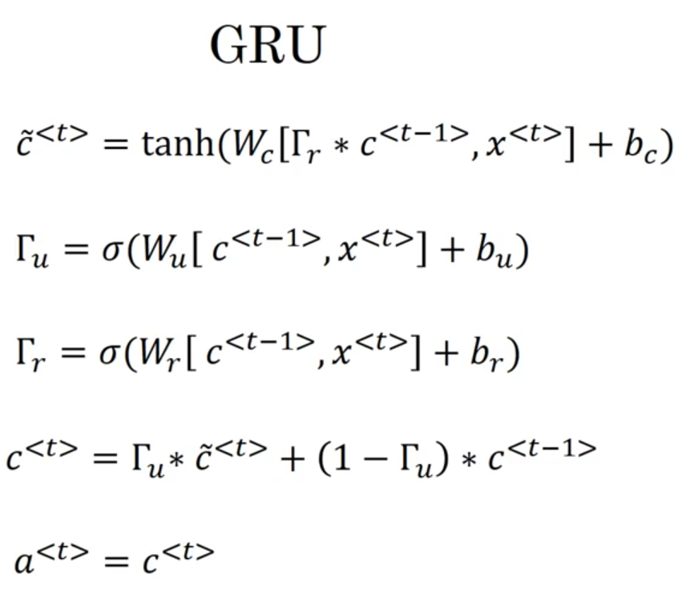

### 6.3 长短期记忆（LSTM（long short term memory）unit

GRU能够让我们在序列中学习到更深的联系，长短期记忆（long short-term memory, LSTM）对捕捉序列中更深层次的联系要比GRU更加有效。

`LSTM`有三个门，分别为更新门($\Gamma_{u}$)，遗忘门($\Gamma_{f}$)，输出门($\Gamma_{o}$)

- 更新门($\Gamma_{u}$)：用来决定是否更新$\bar{c}^{\langle t\rangle}$
- 遗忘门($\Gamma_{f}$)：用于来决定是否遗忘上一个$c^{\langle t-1\rangle}$
- 输出门($\Gamma_{o}$)：用于来决定是否输出$c^{\langle t\rangle}$

$$
\bar{} \begin{array}{l}\tilde{c}^{\langle t\rangle}=\tanh \left(w_{c}\left[a^{\langle t-1\rangle}, x^{\langle t\rangle}\right]+b_{0}\right) \\
\left.\begin{array}{l}\Gamma_{u}=\sigma\left(w_{n}\left[a^{\langle t-1\rangle}, x^{(t\rangle}\right]+b_{u}\right) \\
\Gamma_{f}=\sigma\left(w_{f}\left[a^{\langle t-1\rangle}, x^{\langle t\rangle}\right]+b_{f}\right) \\
\Gamma_{0}=\sigma\left(w_{o}\left[a^{\langle t-1\rangle}, x^{(t\rangle}\right]+b_{0}\right)\end{array}\right\} \\c^{\langle t\rangle}={\Gamma_{u}} * {\tilde{c}^{\langle t\rangle}}+{\Gamma_{f}} * {c^{\langle t-1\rangle}} \\a^{\langle t\rangle}=\Gamma_{0} * c^{\langle t\rangle}\end{array}
$$

两者的区别：

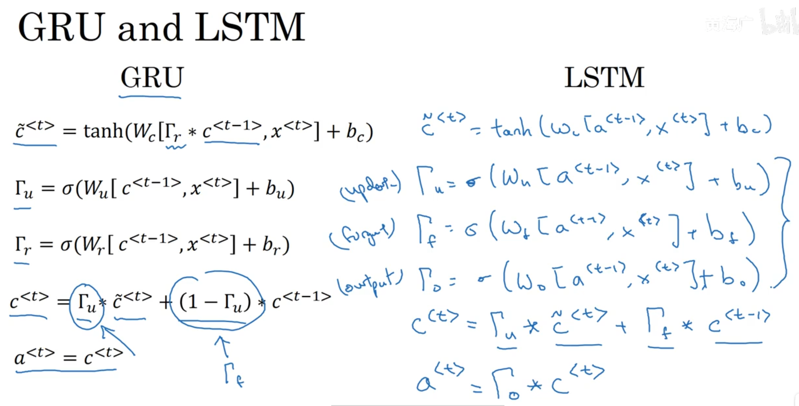

画成图后：

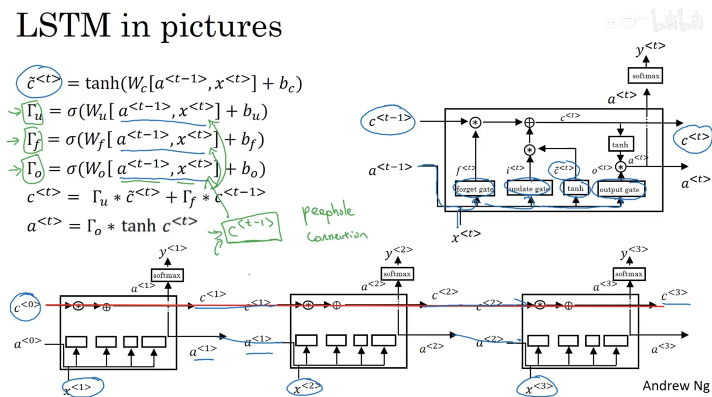

---

## 7. 双向循环神经网络（Bidirectional RNN）

双向RNN（bidirectional RNNs）模型能够让我们在序列的某处，不仅可以获取之间的信息，还可以获取未来的信息。

基本的RNN单元，还是GRU，或者LSTM单元都是前向的，从前面获取信息，基本的RNN单元，还是GRU，或者LSTM单元

双向RNN则可以解决单向RNN存在的弊端。在BRNN中，不仅有从左向右的前向连接层，还存在一个从右向左的反向连接层，进行反向的前向传播计算激活值

缺点就是需要完整的序列信息

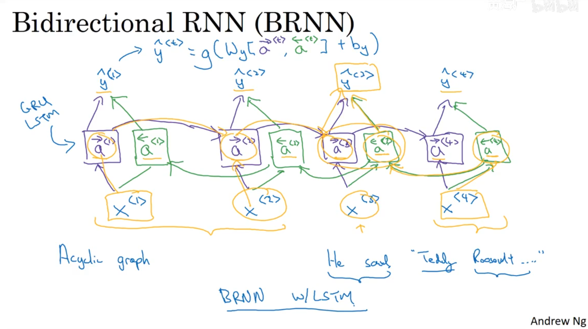

---
