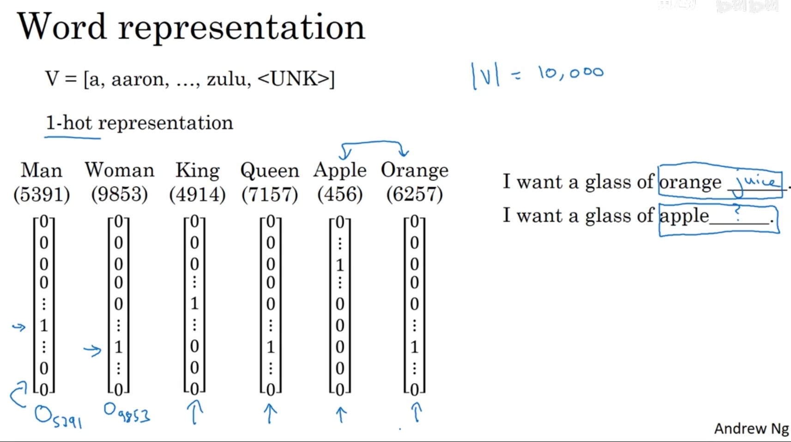

# 自然语言处理与词嵌入（Natural Language Processing and Word Embeddings）

## 1. 词汇表征（Word Representation）

我们表征词汇是直接使用英文单词来进行表征的，但是对于计算机来说，是无法直接认识单词的。为了让计算机能够能更好地理解我们的语言，建立更好的语言模型，我们需要将词汇进行表征。

### 1.1 one-hot表征

one-hot表征的缺点：这种方法将每个词孤立起来，使得模型对相关词的泛化能力不强。每个词向量之间的距离都一样，乘积均为0，所以无法获取词与词之间的相似性和关联性。

### 1.2 特征表征：词嵌入

用不同的特征来对各个词汇进行表征，相对与不同的特征，不同的单词均有不同的值。
