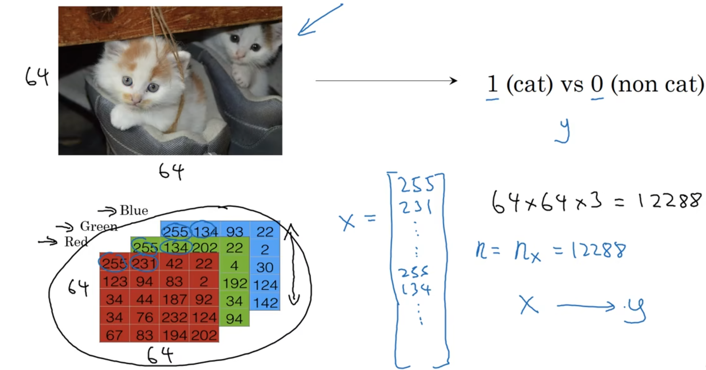
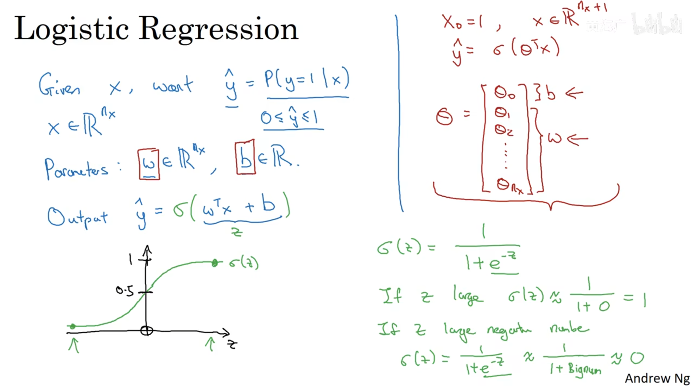
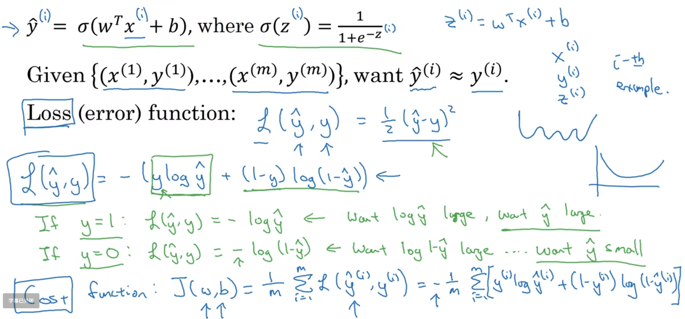
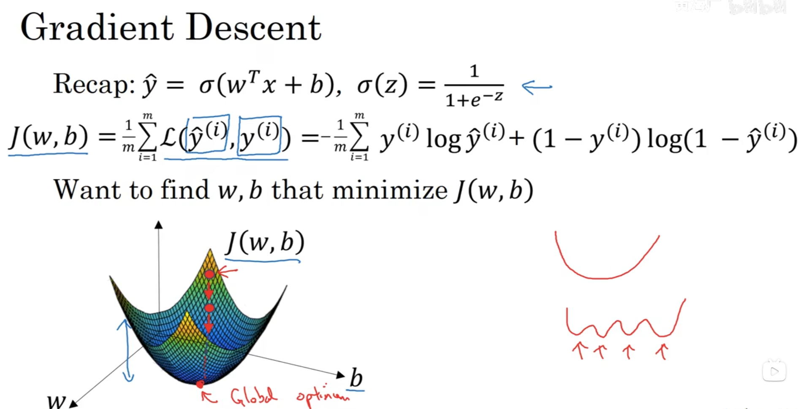
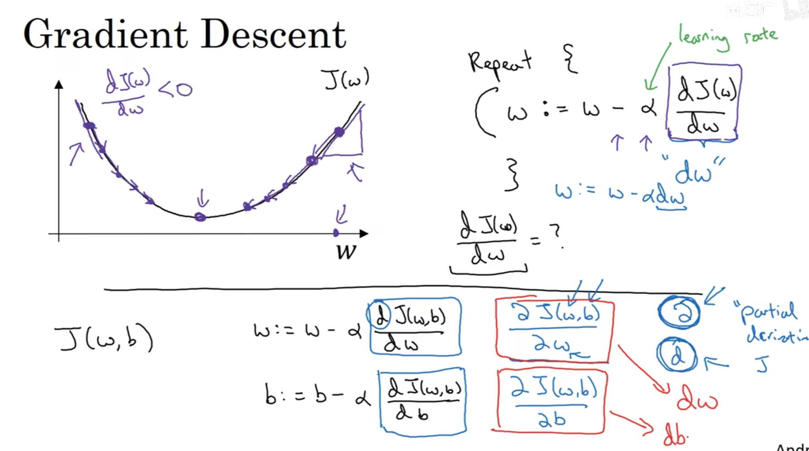
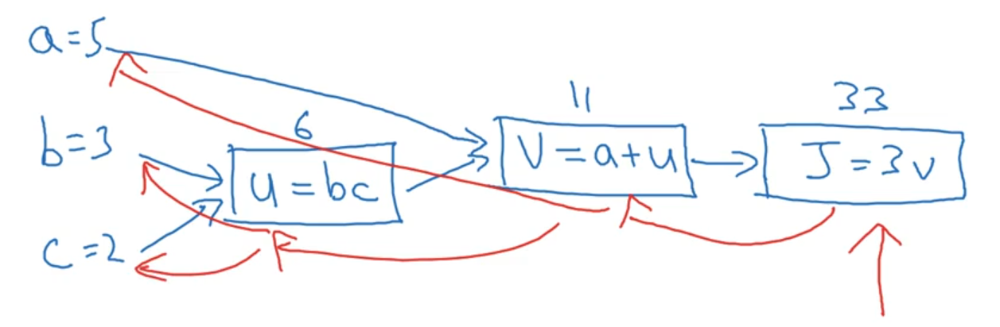

# 神经网络的编程基础

---

## 1. 二分类

### 1.1 Notation(符号)

X and Y

---

## 2. Logistic Regression

估计w,b，使用sigmoid函数激活

### 2.1 Logistic Regression cost function

### 2.2 Gradient Descent

进行梯度下降，获取最小的J(W,b)，注意局部最优解

通过计算W和b的梯度进行梯度下降求最优解

### 2.3 Computation Graph(计算流程)

蓝色为前向传播，红色为反向传播

