# 神经网络的编程基础

- [神经网络的编程基础](#神经网络的编程基础)
  - [1. 二分类](#1-二分类)
    - [1.1 Notation(符号)](#11-notation符号)
  - [2. Logistic Regression](#2-logistic-regression)
    - [2.1 Logistic Regression cost function](#21-logistic-regression-cost-function)
    - [2.2 Gradient Descent](#22-gradient-descent)
    - [2.3 Computation Graph(计算流程)](#23-computation-graph计算流程)
    - [2.4 Logistic Regression Gradient descent](#24-logistic-regression-gradient-descent)
    - [2.5 Gradient descent on m examples](#25-gradient-descent-on-m-examples)
    - [2.6 Vectorizing Logistic Regression](#26-vectorizing-logistic-regression)

---

## 1. 二分类

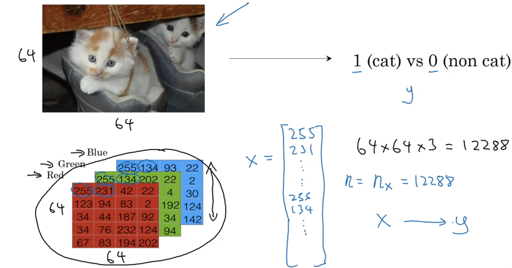

### 1.1 Notation(符号)

X and Y

---

## 2. Logistic Regression

估计w,b，使用sigmoid函数激活

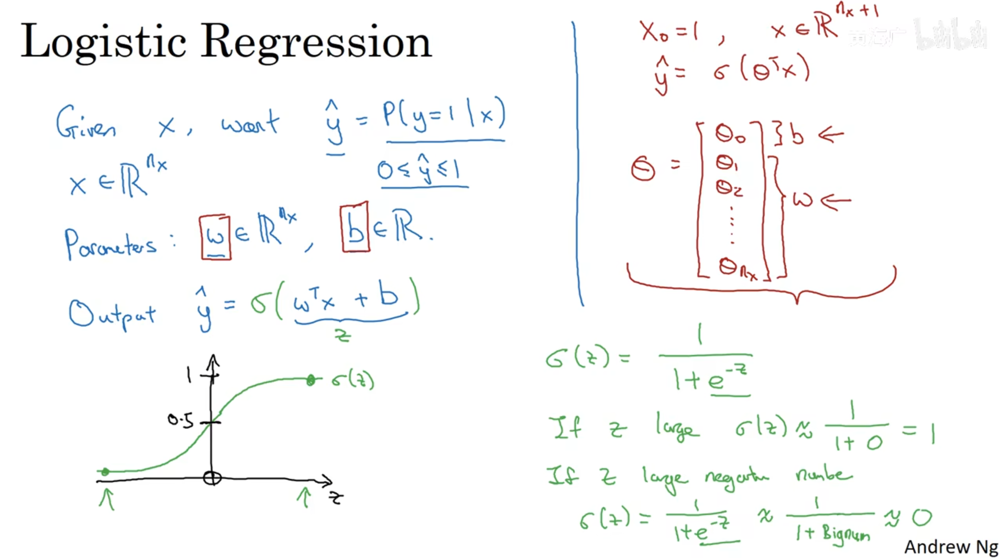

### 2.1 Logistic Regression cost function

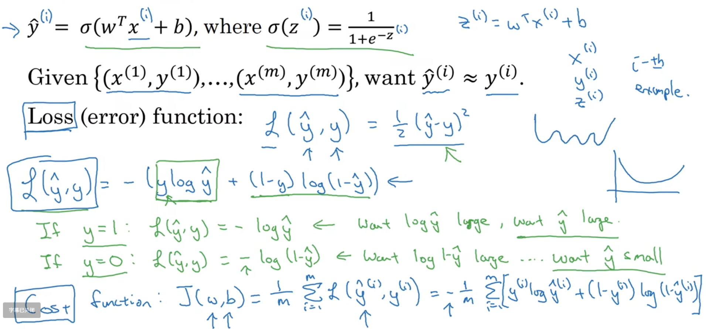

证明

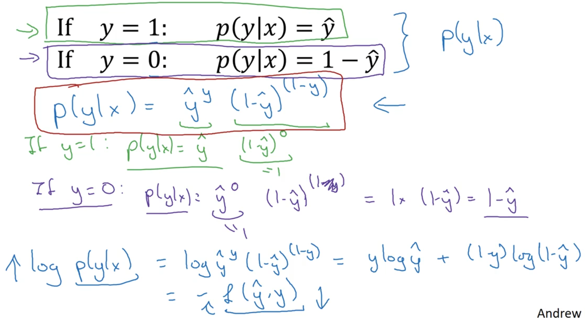

### 2.2 Gradient Descent

进行梯度下降，获取最小的J(W,b)，注意局部最优解

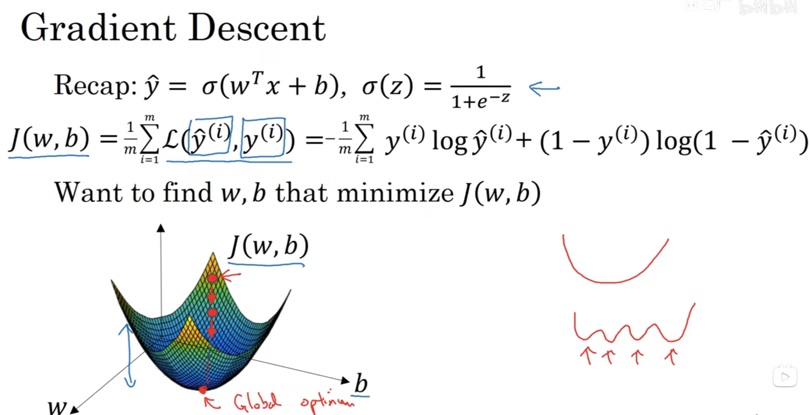

通过计算W和b的梯度进行梯度下降求最优解

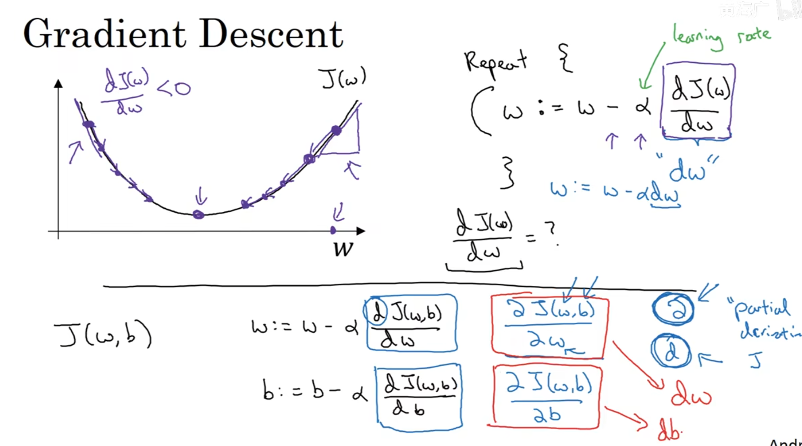

### 2.3 Computation Graph(计算流程)

蓝色为前向传播，红色为反向传播

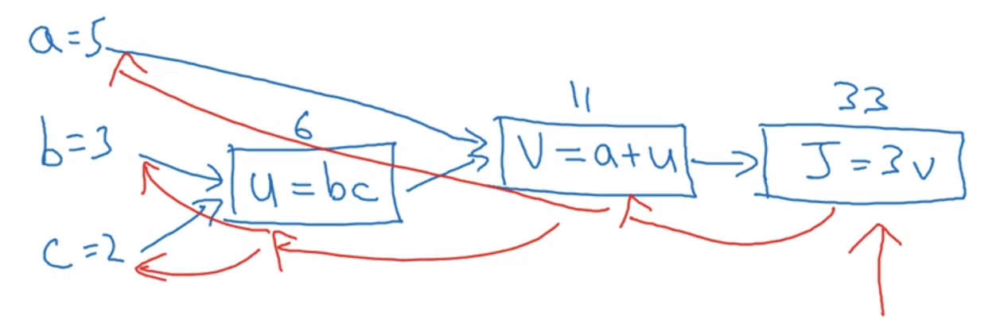

反向传播计算J对a的偏导，J对b的偏导，J对c的偏导，使用链式法则

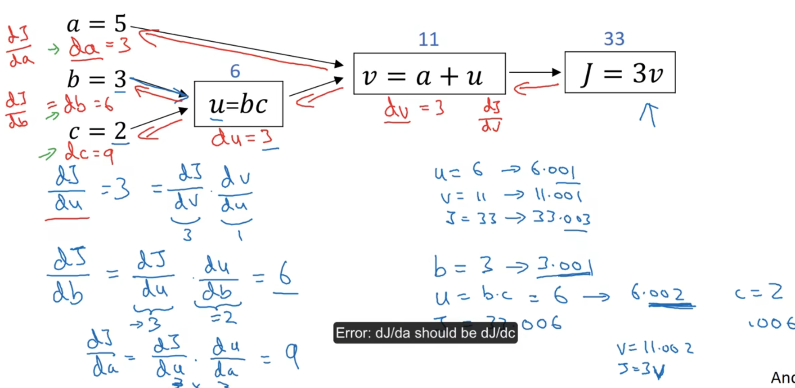

### 2.4 Logistic Regression Gradient descent

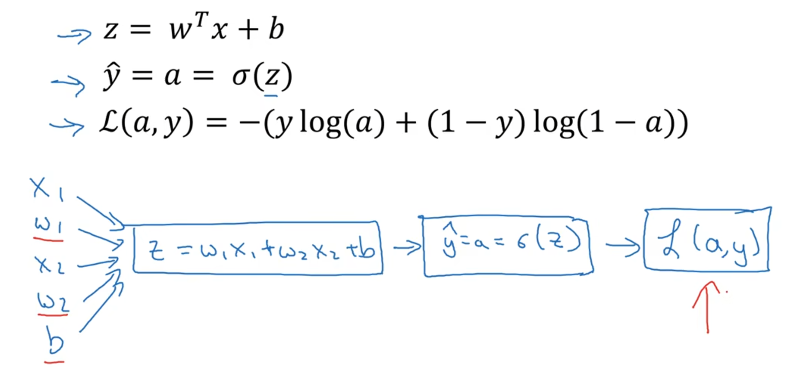

反向求导，进行梯度下降

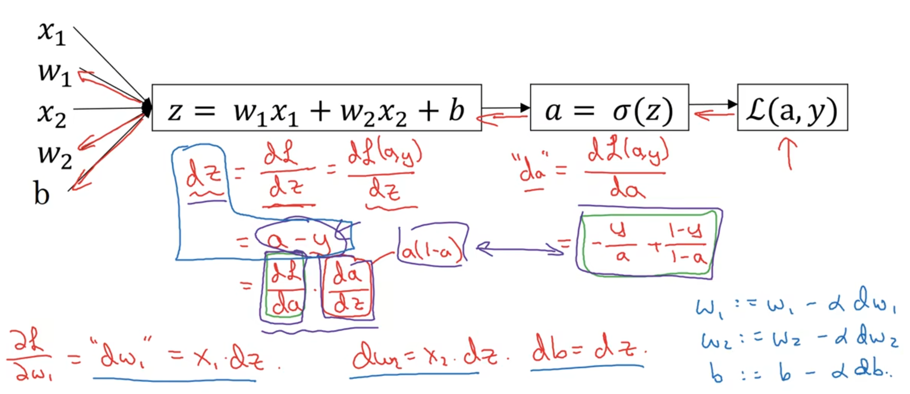

### 2.5 Gradient descent on m examples

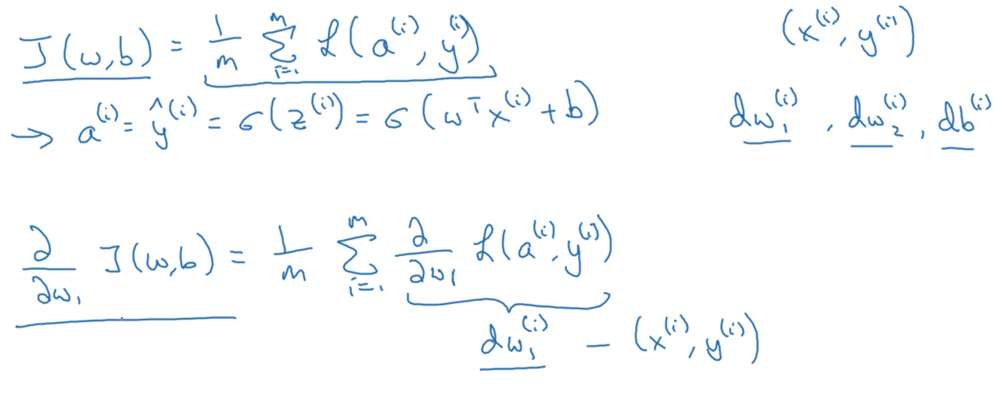

使用for循环计算

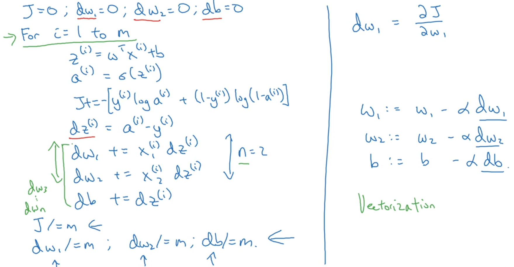

Vectorization向量化实现

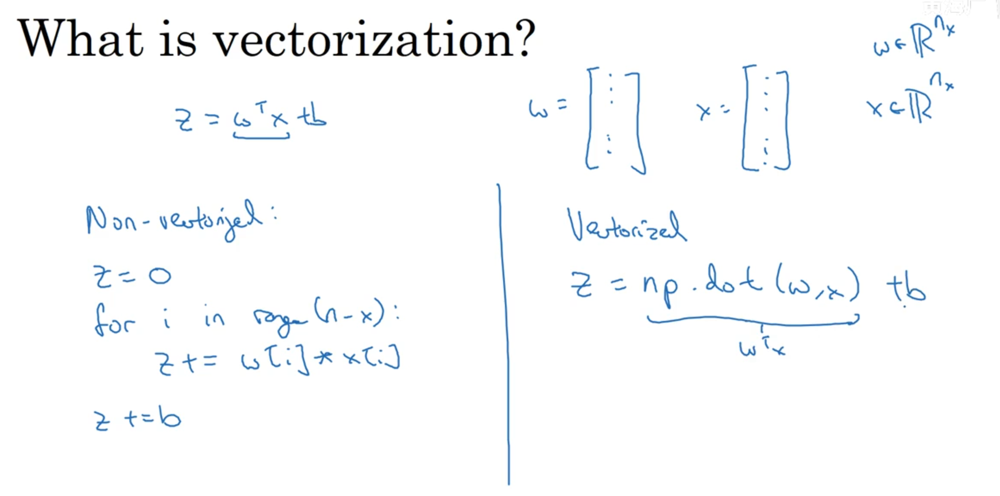

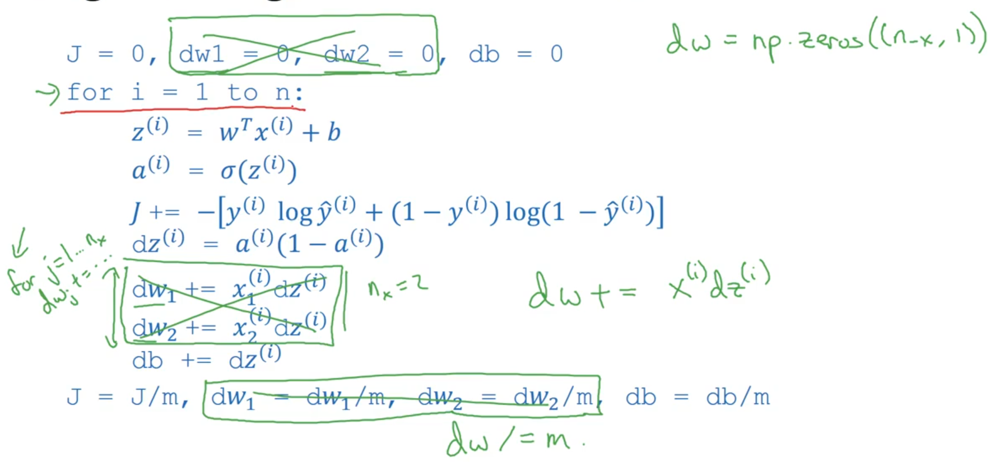

### 2.6 Vectorizing Logistic Regression

向量化求z 和 a

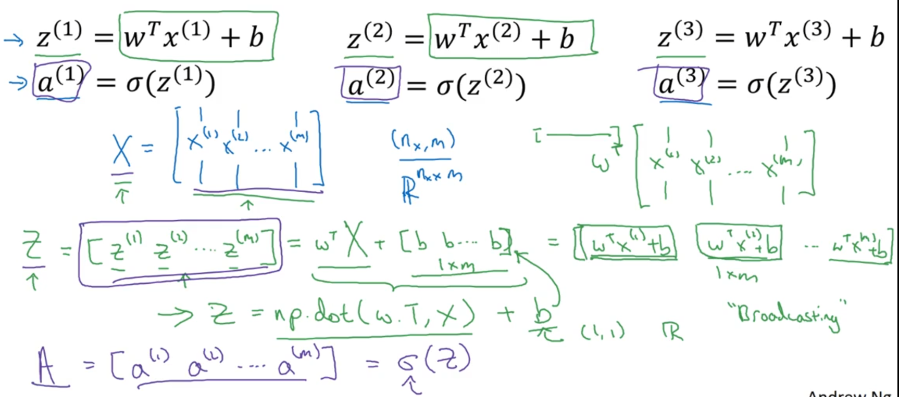

向量化进行前向传播和反向传播，求dz，db，dw

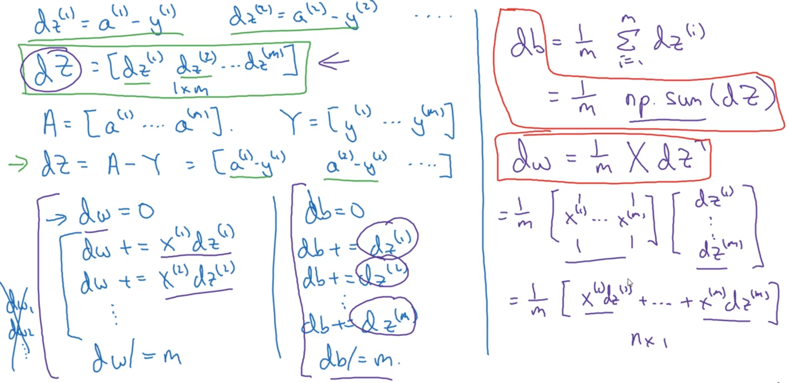

将上面的总结一下

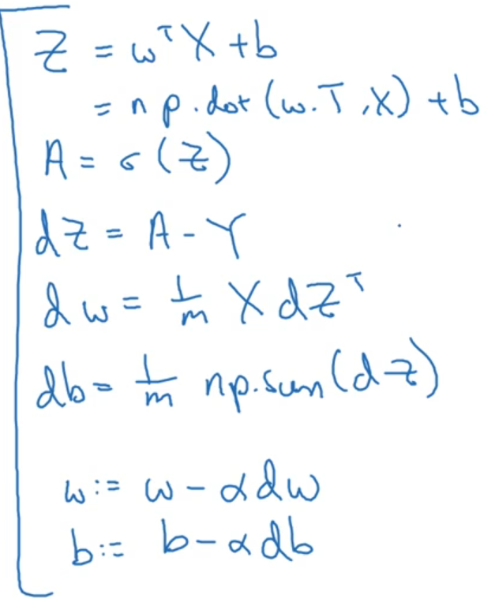

---
