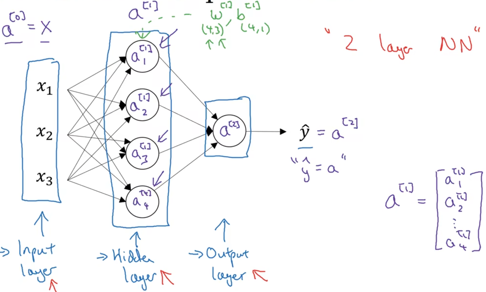
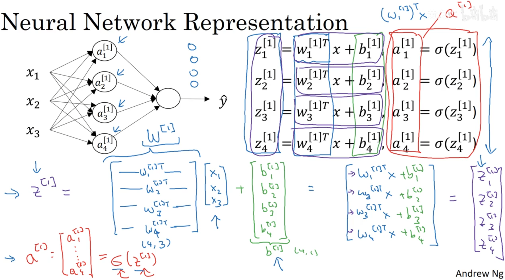
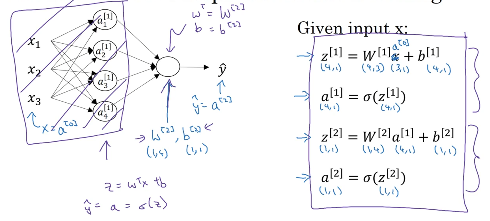
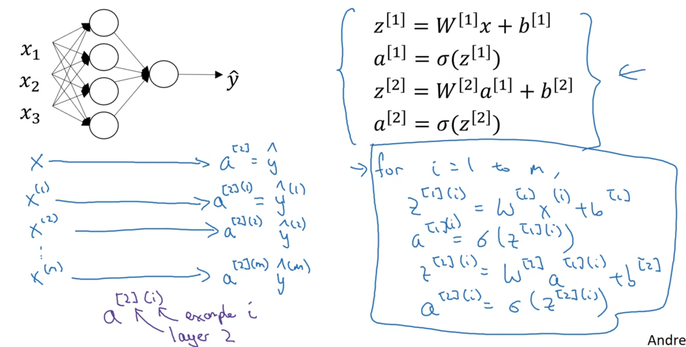
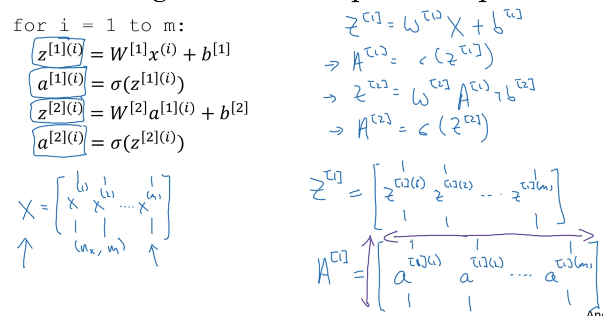
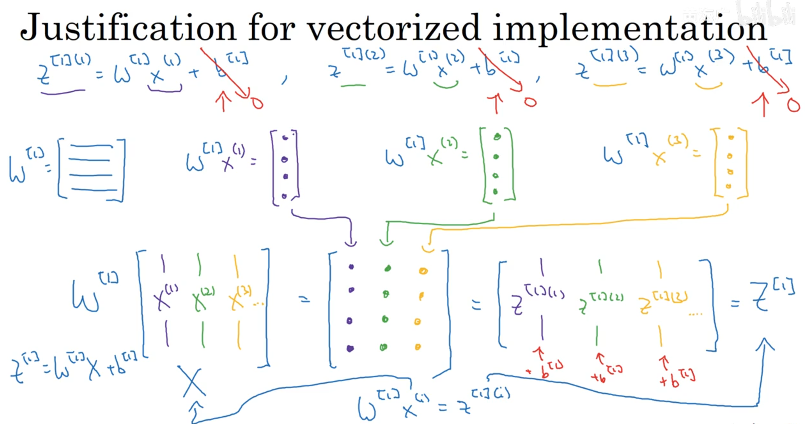
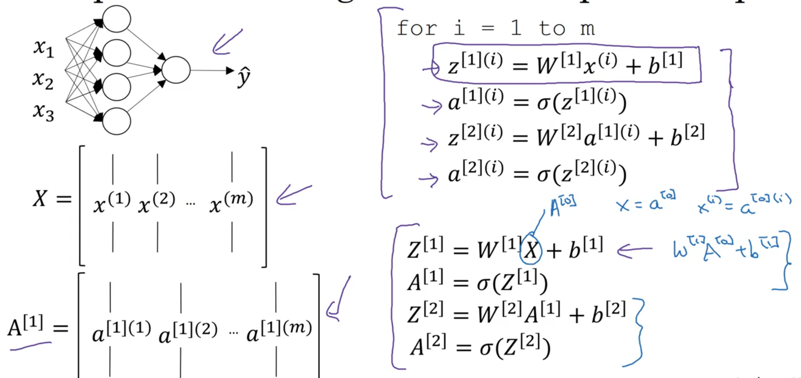

# 浅层神经网络的实现

---

## 1. Neural Network Respresentation

2层神经网络，不同符号表示

---

## 2. Computing a Neural Network's output

计算隐藏层

输入x，用4个等式计算，向量化

---

## 3. Vectorizing across multiple examples（多样本向量化）

多个样本

将m个样本横向堆叠，进行向量化运算

---

## 4. Activation functions

