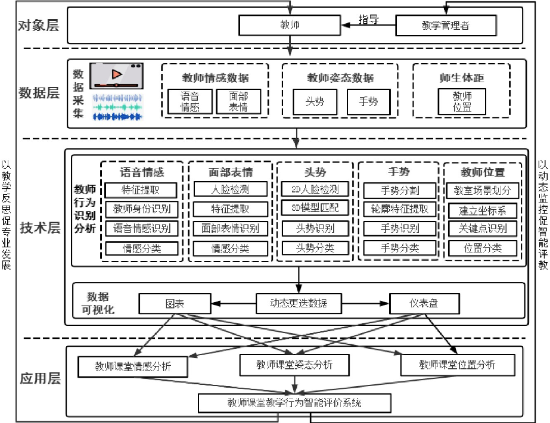
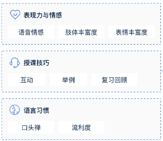

# 五、课堂评价（含互动行为分析与评价功能）应用系统

---

## 1. EduSense课堂分析系统

**系统名称**：EduSense课堂分析系统

**系统功能描述**：EduSense 是一个基于人工智能的课堂行为感知系统，利用计算机视觉和多模态数据融合技术，实时分析课堂中的师生行为与互动。其功能包括：行为检测：捕捉教师和学生的动作（如走动、举手、抬头等）。目光追踪：识别师生目光方向以分析注意力分布。语音分析：分析课堂中师生的互动频率和声音分布。数据分析与可视化：生成课堂行为的可视化图表（如热图、运动轨迹图）。实时反馈：为教师提供教学行为的实时分析，帮助优化教学策略。

**互动行为模块介绍**：

- **坐姿与站姿**：用来区分课堂活动的不同阶段，比如讨论或小组活动的开始和结束。
- **举手**：举手的频率和数量是学生参与度的良好指标，并且与积极的教学效果有关联。
- **上半身姿势**：教师和学生的身体姿势反映了他们的开放或闭合状态，传达了接纳性或疏离感。
- **微笑**：面部表情提供了丰富的信息，反映学生的情感状态，如参与感、沮丧感等。
- **头部朝向、注意力、课堂视线**：学生的目光朝向不同的课堂物品（如黑板或讲义）可以表明其注意力方向，而与老师的目光对视则显示学生对老师的兴趣。
- **身体位置与课堂布局**：教师在课堂中的位置影响参与度，均匀移动到教室各个区域的教师被认为更加有效。
- **加速度计数据**：运动模式可以区分高效教师和普通教师。教师的频繁移动与课堂管理效率有关，而学生在不同任务期间的移动也反映了学习行为的差异。
- **学生与教师的言语互动**：有效的教学通常包含师生之间的讨论和提问。通过分析师生言语模式及言语比例，可以更好地了解学生的参与度，并引导教师采取适当的教学策略。
- **语音行为界定**：言语的频率和持续时间与参与度高度相关，通过分析教师言语之间的沉默间隔，可以优化课堂管理，促进师生的互动。

**来源**：**研发机构**：卡内基梅隆大学人机交互研究所（Human-Computer Interaction Institute）**URL**：https://www.edusense.io/

---

## 2. 教师课堂教学行为智能评价的应用框架

**系统名称**：教师课堂教学行为智能评价的应用框架

**系统功能描述**：本研究以智能技术助推教师课堂教学行为框架构建为研究目标，提出了一种融合多模态行为分析的教师课堂教学行为评价的应用框架，关注教师的课堂情感变化、姿势引导和课堂位置，以帮助教师及时调整和反思课堂教学行为。本研究仅需上传常规的课堂视频即可进行评价，故不采用需佩戴仪器采集的目光和生理数据，而是在现有研究的基础上，增加了可提高师生互动的位置分析，构建了集教师情感、姿态、位置三维一体的教师课堂教学行为智能评价系统。

**互动行为模块介绍**：利用深度录播系统采集教师的语音情感、面部表情、头势、手势和教师位置信息，建立教师课堂教学行为测评数据集（如下表所示），帮助开展教师课堂教学行为的过程性评价。

**来源**：**研发机构**：华中师范大学人工智能学部 **URL**：https://foaie.ccnu.edu.cn

---

## 3. 智能技术支持的多模态互动教学评价框架

**系统名称**：智能技术支持的多模态互动教学评价框架

**系统功能描述**：从多模态互动教学分析的角度出发，依托社会建构主义学习理论，本研究设计了智能技术支持的多模态互动教学评价框架。此评价框架分为指标层、数据层、技术层、结果层和应用层，其中指标层将互动教学解构，形成了包含互动范围、互动参与度等五个维度的评价指标；数据层采用录像技术，无感化采集课堂教学数据；技术层利用计算机视觉、语音识别、情感分析等智能技术对视频进行识别和分析，并基于分级规则对数据进行处理与计算；结果层采用可视化技术，直观展现多模态互动教学的质量；应用层则阐释评价框架在教学诊断、教学改进和教师发展评价中所起的重要作用。

**互动行为模块介绍**：本研究构建了包含互动范围、互动参与度、互动亲密度等五维评价指标体系。采用量化分级方法，按照互动教学评价分级规则（如右表所示）展开评价。

- **互动范围**：指参与互动的学生人数，用于评估互动的广度；
- **互动参与度**：指学生参与互动的积极性，用于评估学生参与的兴趣；
- **互动亲密度**：指互动时教师在空间位置、面部表情、语音情感方面的表现，用于评估互动中师生物理空间和心理空间的接近程度；
- **互动公平性**：指学生个体参与回答问题的次数，用于评估教师分配互动机会的均衡性；
- **互动深度**：指师生提出问题的认知层次，用于评估师生认知交互的深度。

**来源**：**研发机构**：华中师范大学人工智能学部 **URL**：https://foaie.ccnu.edu.cn

---

## 4. Edulyze 分析引擎

**系统名称**：Edulyze 分析引擎

**系统功能描述**：Edulyze 分析引擎是一种先进的教育数据分析系统，专注于课堂教学的行为分析和学习数据驱动优化。通过多模态数据（音频、视频、交互记录）的深度融合，Edulyze 能够为教师和教育机构提供实时反馈和可视化报告，提升教学质量。其核心功能包括：课堂行为分析：识别和分类课堂行为（如教师授课风格、学生参与度）。情感与互动追踪：通过分析面部表情和语音数据评估课堂情绪状态。数据整合与预测：基于大数据分析，提供教学效果预测与优化建议。自定义报告生成：生成行为趋势图、热图以及互动网络图，支持教师改进教学策略。

**互动行为模块介绍**：包含位置模块，Gaze模块，音频模块。

位置模块：

- **Object Interaction**：分析教师与教室内的物体（如讲台、黑板等）的互动频率；
- **Movement Metrics**：记录教师在课堂中的移动和静止时间；
- **Principal Movement Direction**：分析教师的主要移动方向和模式；
- **Top Locations**：列出教师在课堂中最常驻留的五个位置，以揭示其空间教学模式；
- **Head/Body Movement**：通过记录教师和学生的头部和身体移动情况，分析其参与度；
- **Seating Arrangement**：分析学生的座位分布，如朝向讲台、围成小组等。

Gaze模块：

- **Principal Gaze Direction**：分析教师和学生的主要注视方向，以评估课堂互动的紧密程度；
- **Prolonged Gaze**：分析教师长时间注视的方向和对象；
- **Location-Specific Patterns**：分析教师和学生在不同位置的注视变化；
- **Aggregated Gaze Metrics**：计算学生集体注视的焦点，例如注视讲台或黑板的位置，以提供课堂注意力的总体分布情况。

音频模块：

- **Silent vs. Non-silent Periods**：检测课堂中讲话和安静的时间段，以分析教师和学生之间的语言互动情况。

**来源**：**研发机构**：卡内基梅隆大学人机交互研究所（Human-Computer Interaction Institute） **URL**：https://www.edusense.io

---

## 5. 好未来授课质量分析解决方案

**系统名称**：好未来授课质量分析解决方案

**系统功能描述**：方案构成包括授课技巧检测，语言习惯评测和表现力与情感评测，通过底层的语音、图像、NLP等AI技术的运用，结合教学教研的理念，从多维度对授课视频进行评测。传统练课方式，老师难以评估自己练课的效果，通过授课视频质量分析解决方案可以分析老师授课过程中的互动、举例、表情、肢体动作等指标，给出评测报告，指导老师结合具体指标提升授课能力。

**
互动行为模块介绍**：

- **授课技巧评测**：是通过对老师授课视频进行分析，检测视频中老师互动、举例、复习出现的时间点，并且结合内容进行有效互动点的判断，综合评价老师授课的专业性。
- **语言习惯检测**：是基于自然语言处理技术，检测老师授课过程中口头禅出现的时间点，以及通过多维语音特征、精准判断老师语速、停顿等信息，并且结合授课内容判断老师授课的流利度。
- **表现力和情感评测**：是基于多维语音特征，结合老师说话的语速、语调等数据，判断老师授课是否抑扬顿挫、情感丰富；基于人脸识别、表情分析、人体分析等技术评估老师在授课过程中的表情丰富度和肢体丰富度，精准判断老师的把表现力。

**来源**：**研发机构**：北京世纪好未来教育科技有限公司 **URL**：https://ai.100tal.com/solution?name=s-tgc

---

## 6. 希亚思课堂智能评测系统

**系统名称**：希亚思课堂智能评测系统

**系统功能描述**：课堂智能评测系统，通过连续完整地采集和评测学生上课时的微表情变化，能够实时分析课堂整体的授课气氛转换、师生互动情况、老师的上课类型，也能够形成每位学生的注意力和课堂活跃度等的听课数据集。通过整个课程单位的大数据分析等应用，能够提供老师和家长以相同的客观数据，可以有针对性地共同帮助学生提高学习成绩。

**互动行为模块介绍**：

**课堂整体评价指标**:

- **课堂气氛活跃度**：能够较为客观地反映师间的互动情况和学生们接受知识点时的兴奋平静、困惑等情绪变化，间接地反映出老师的备课内容、课程设计等课前准备和实际上课时的互动情况。
- **学生课堂参与度**：主要通过分析学生在课堂上的情绪及行为的转换频率反应学生对于教师授课的参与程度。参与度的高低和老师在这堂课上的教学手法及课程节奏的把控息息相关。
- **老师授课类型**：通过计量和分析学生的听课、讨论和练习及实验的时间配比，结合各年级的语文、数学等课型特点的大数据分析，能够智能地分析出这堂课属于讲授型、对话型等授课类型。

**学生个体评价指标**:

- **学生个体活跃度**：能够连续动态地分析每位学生的思考、倾听、活跃等情绪状态的变化。通过这些变化特点，能够较清晰地把握该学生在课程各个节点的参与程度，帮助老师了解该学生在听讲和掌握知识点时的特点，有利于精准分析以学生为单位的讲课效果和了解不同类型学生的课程参与情况。
- **学生个体注意力**：主要通过追踪捕捉和分析每位学生的注意力集中与分散的比例，数据化呈现以往只能靠老师主观描述的上课注意力的变化情况。这个评测能够解决了老师无法准确把握每位学生上课情况的难题，而且能够帮助尽早发现学生上课注意力不集中的特点和原因，针对性地找出解决问题的办法。

**来源**：**研发机构**：希亚思（上海）信息技术有限公司 **URL**：https://marketplace.huaweicloud.com

---

## 7. 迅维AI教学评估分析系统

**系统名称**：迅维AI教学评估分析系统

**系统功能描述**：AI课堂评估分析系统分为采集系统，分析系统和管理系统。其中分析系统主要为课前，中，后一站教学质量评估分析平台。

**互动行为模块介绍**：

课前、中、后全流程分析。

- **课前阶段**基于教案文本的教学能力设计分析，依照中国教科院最前言的CFS教学设计量规，将传统的依靠主观经验的人工教案标注，分析，评级替代为人工智能的分析方法，诊断教师教学设计不足之处，并提供针对性的改进建议。
- **课中阶段**基于课堂实录的课堂教学质量分析，依据权威的课堂教学量化指标，将课堂实录(音视频)数据结合教育模型进行人工智能分析，呈现全方位、多维度的课堂教学评价结果。
- **课后阶段**通过人工智能技术将课前教学设计和课中教学过程对比分析，得到课后教案执行情况分析数据。便于教师课后反思教学过程，改进教学设计，形成课前课后的全流程闭环的教学量化分析，提升教师教学设计和课堂教学能力，助力教师教学综合能力整体提升。

**来源**：**研发机构**：成都讯维信息技术有限公司 **URL**：https://www.xunwei.tm/ai/jxfx.html

---

# 总结与评价

## 1）现有系统的功能总结

这些系统主要围绕以下功能展开：

- 音频分析：使用麦克风记录师生语言交流，分析语速、语调、停顿和言语互动。支持检测课堂安静与非安静时间段、语言使用频率、课堂氛围（如活跃、沉闷）、
- 动作分析：利用摄像头捕捉师生行为，记录站姿、举手、头部朝向、移动路径等，细化教学行为数据，分析学生的注意力变化（如头部方向）、参与动作（如举手发言）、教师的教学动作（如在不同区域的移动）等。
- 表情与姿态分析：通过表情识别捕捉学生的情绪波动，例如微笑、专注或困惑，结合姿态分析（如头势、手势）评估情绪与参与状态。
- 可视化评教结果：生成教师行为的智能分析报告，支持教师反思和改进教学，实时解析师生互动行为。

## 2）现有系统的水平评价

优点：

- 系统广泛使用音频、视频、表情识别和位置传感器等多模态数据采集方式，全面捕捉课堂动态。
- 智能互动教学评价框架和希亚思课堂智能评测系统提供了多维互动指标，能量化互动范围、深度和公平性。
- 系统大多基于成熟的 AI 技术（如人脸识别、语音分析），具有较高的稳定性和应用可靠性。
- 大部分系统重视数据的存储和传输安全，采用标准化的数据保护机制。
- 大多都是分析了课堂上老师和学生的行为动作，语音,进行了课堂数据可视化，没有生成综合性评估。

缺点：

- 部分系统在数据采集精度和实时性上有改进空间。例如，在低光或复杂环境中，视频采集的准确性可能下降。
- 情感分析的鲁棒性较依赖表情和语音，可能对多文化背景的适应性不足（如表情习惯差异）。
- 在低延迟实时性和对突发情况的动态适应方面，仍有进一步提升空间。
- 涉及人脸、表情、语音等敏感信息，可能引发隐私保护问题，需进一步加强对数据使用的透明性和合规性。

## 3）我们未来系统的主要功能

- 教师行为分析：
  - 识别教师的主要动作（如讲课、提问、板书）。
  - 分析教师在课堂中的位置分布和移动模式（如热点区域）。
  - 记录教师与教学物体的交互行为（如使用投影仪、白板）。
- 学生行为分析：
  - 检测学生的注意力状态（如抬头、低头、走神）。
  - 识别学生的参与行为（如举手、回答问题）。
- 情绪分析：
  - 使用面部表情识别技术，实时捕捉师生的情绪变化（如愉悦、困惑、疲倦）。
- 音频分析：
  - 分析语音情感和语调，检测课堂的活跃度与沉默期等。
  - 区分提问、回答、讨论等不同的语音类型。
- 课堂实时反馈：
  - 提供实时可视化报告，包括参与度曲线、情绪热图、行为分类统计。
  - 为教师提供教学调整建议（如提问更多学生、切换教学区域）。
  - 生成教学效果评估报告。

